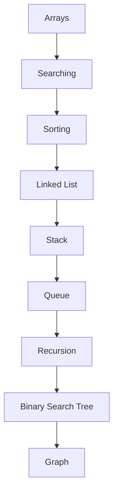

# 🚀 Data Structures & Algorithms

### Master DSA Through Practical Implementations

### 📚 Learn • Practice • Build • Master

A complete collection of Data Structures and Algorithms implementations with explanations, visualizations, and practical examples.

## ✨ Repository Highlights

| Feature | Description |
|----------|-------------|
| 🎯 Beginner Friendly | Designed for students starting DSA |
| 💻 C++ Implementation | Clean and understandable code |
| 📚 Academic Focus | Covers common university lab topics |
| 🚀 Interview Preparation | Useful for coding interviews |
| 🏗️ Project Based Learning | Learn by implementing |
| ⭐ Open Source | Contributions are welcome |
## 🗺️ DSA Learning Path

## 📚 Topics Covered

| # | Topic | Status |
|---|--------|--------|
| 01 | Linear Search | ✅ |
| 02 | Binary Search | ✅ |
| 03 | Bubble Sort | ✅ |
| 04 | Selection Sort | ✅ |
| 05 | Matrix Operations | ✅ |
| 06 | Singly Linked List | ✅ |
| 07 | Doubly Linked List | ✅ |
| 08 | Stack | ✅ |
| 09 | Stack Applications | ✅ |
| 10 | Queue | ✅ |
| 11 | Recursion | ✅ |
| 12 | Binary Search Tree | ✅ |
| 13 | Graph Traversal | ✅ |
---

### 👨‍💻 Developed By

# Taskin Billah Tamim

Computer Science & Engineering Student

### ⭐ If this repository helped you, consider giving it a star.

